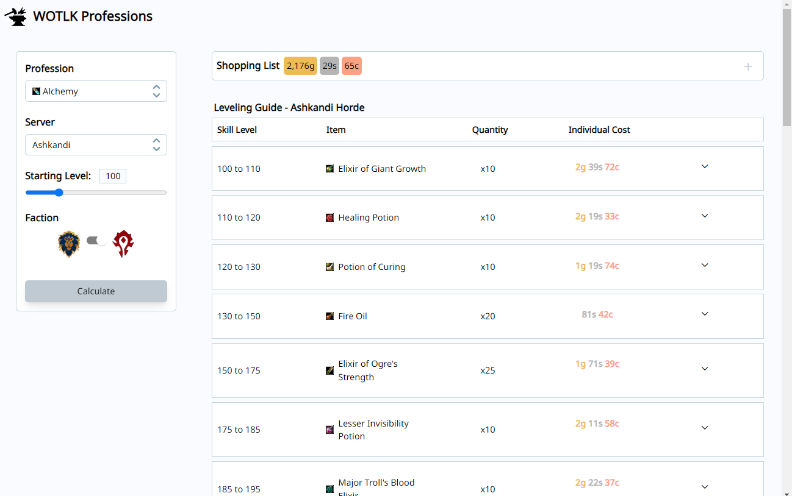
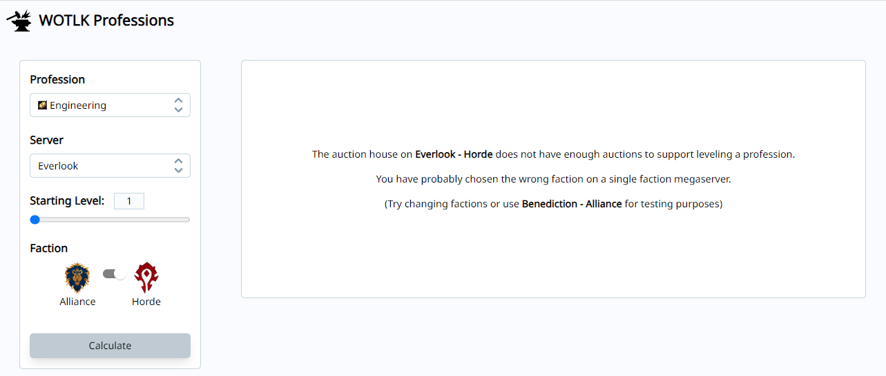

<h1 align="center">WOTLK Profession Leveling Optimizer</h1>

<a href="https://wotlk-professions.onrender.com/">>>Live Demo hosted on Render<<</a>

 (Please allow 1-2 minutes for application to spin up from inactivity if there is no pricing information)

 This application dynamically calculates the most cost-effective recipes for leveling any crafting profession in World of Warcraft: Wrath of the Lich King Classic. Unlike existing profession leveling guides, which are handwritten and static, my tool takes into account real-time price variations based on server and faction.
 
 
I specifically wanted to solve the problem of artificial price inflation on certain recipe materials caused by current guides. A majority of players utilize the same leveling guide which causes the specific materials needed to follow the guide to skyrocket in price. There are almost always alternative recipes with much cheaper materials. Additionally, there are often significant fluctuations in material prices which limits the usefulness of a handwritten guide. Instead of manually searching up each recipe, looking up prices, and comparing each one, I decided to make this application to do that automatically.

 

<h2>Home Page</h2>

The user is initially prompted to make selections and can choose their desired profession (and starting level) as well as their server and faction. The displayed choices are selected by default.

<h2>Leveling Guide</h2>

After making selections and pressing calculate, a leveling guide and associated shopping list are displayed.

<h2>Shopping List</h2>

The shopping list is a collapsible menu that provides a simple list of all the items a player must acquire before starting. This menu also displays the current total cost of all required items.

<h2>Expandable Items</h2>

Individual recipe items can be expanded to view the required materials specific to that recipe. Also note the scrolling selection menu for usability.

<h2>Item Hover</h2>

All items (both recipes and reagents) link to their wowhead webpage and are also hoverable for a quick preview.

<h2>Selection Demo</h2>

Here the user has selected the Alchemy profession starting at level 100 on the Ashkandi server, Horde.

<h2>Unpopulated Realms</h2>

Due to single faction megaservers, many server and faction combinations don't have a sufficient player population or enough 
items on the market to support leveling a profession. An error message is displayed and
user is prompted to make another selection.

